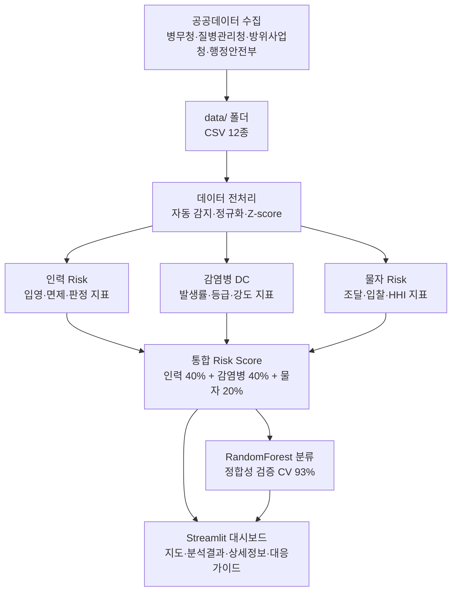

# TriGuard AI 🛡️

> 감염병·병역자원 데이터 기반 지역별 병력운용 Risk Score 분석 및 조기경보 시스템

[](https://triguard-ai.streamlit.app)

---

## 📌 프로젝트 개요

본 프로젝트는 병무청·질병관리청·방위사업청·행정안전부 등 5개 공공기관의 12종 공공데이터를 활용하여
지방청별 병력운용 위험도를 정량적으로 산출하고, 조기경보 및 대응 가이드를 제공하는 AI 의사결정 지원 시스템입니다.

- **공모전**: 2026년 병무청·방위사업청·질병관리청 합동 공공데이터·AI 활용 경진대회
- **부문**: 제품 및 서비스 개발
- **분석 대상**: 전국 14개 지방청

---

## 🔄 데이터 흐름



---

## 📊 주요 데이터

| 기관 | 데이터 종류 | 활용 지표 |
|------|------------|----------|
| 병무청 | 입영·판정·면제·재신체·차출 현황 | 인력 Risk (40%) |
| 질병관리청 | 감염병 발생률·등급·인플루엔자·호흡기 | 감염병 DC (40%) |
| 방위사업청 | 조달·입찰·HHI·수의계약 현황 | 물자 Risk (20%) |
| 행정안전부 | 지역별 주민등록 인구 | 인력 보정 기준 |
| 무역안보관리원 | 전략물자 비율 | 물자 Risk 보완 |

---

## 🤖 AI 기술 스택

- **Risk Score 엔진**: 가중합 기반 정량 산출 (인력 40% + 감염병 40% + 물자 20%)
- **ML 모델**: RandomForest 분류기 (5-fold CV 정확도 93%)
  - ※ 93%는 최종 실전 성능이 아닌, Rule-based Risk Score와 ML 예측 간 정합성 검증 지표
- **이상 탐지**: Z-score 기반 이상 지역 탐지
- **상관 분석**: Pearson 상관계수 (인력-감염병 연관성)
- **시각화**: Plotly choropleth 지도, Streamlit 대시보드

---

## 📈 실데이터 분석 결과

| 구분 | 지방청 수 |
|------|----------|
| 🔴 위험 (60점 이상) | 0개 |
| 🟡 주의 (35~60점) | 13개 |
| 🟢 정상 (35점 미만) | 1개 |
| 전체 | 14개 |

> 물자 Risk는 방위사업청 데이터 특성상 지역 단위 구분이 불가하여 전국 공통 외생 리스크(20.4/100)로 반영

---

## 🖥️ 대시보드 구성

| 탭 | 내용 |
|----|------|
| 🗺️ 지도 | 지방청별 Risk Score choropleth 지도 |
| 📊 분석 결과 | 통합 Risk Score 테이블 + AI 분석 결과 |
| 🔍 상세 정보 | 인력·감염병·물자 세부 지표 |
| 📋 대응 가이드 | 리스크 원인별 맞춤형 대응 가이드 |

---

## ⚙️ 실행 방법

```bash
git clone https://github.com/heechan9/triguard-ai.git
cd triguard-ai
pip install -r requirements.txt
streamlit run app.py
```

CSV 12종을 `data/` 폴더에 배치하면 자동 감지됩니다.

---

## 📂 데이터 준비

| 기관 | 데이터 | 출처 |
|------|--------|------|
| 병무청 | 입영인원·병역판정·병역면제·재신체·차출 현황 | 공공데이터포털 |
| 질병관리청 | 감염병 발생률·등급·인플루엔자·급성호흡기 | 공공데이터포털 |
| 방위사업청 | 조달·입찰 현황 | 공공데이터포털 |
| 행정안전부 | 주민등록 인구 현황 | 공공데이터포털 |

> 📥 데이터 출처: [공공데이터포털](https://www.data.go.kr) 및 각 기관 공식 사이트
> ⚠️ CSV 파일은 저작권 등의 이유로 본 저장소에 포함되지 않습니다.

---

## 📁 프로젝트 구조
triguard-ai/

├── app.py                  # 메인 Streamlit 앱

├── modules/

│   ├── preprocess.py       # 데이터 파싱 (12종)

│   ├── risk_engine.py      # Risk Score 계산 엔진

│   ├── ml_engine.py        # AI 예측 모델

│   └── visualize.py        # 시각화 (지도·차트·ML결과)

├── korea_provinces.json    # 한국 시도 GeoJSON

├── data/                   # ⚠️ CSV 12종 직접 배치 필요 (Git 미포함)

│   └── (CSV 12종 직접 배치 필요)

├── requirements.txt

└── README.md

---

## 👥 팀 구성

본 프로젝트는 3인 정규 팀으로 구성되어 있습니다.

| 이름 | 역할 |
|------|------|
| 최희찬 | PM · 문제정의 · 서비스 기획 · 정책성 및 사업화 · 발표 및 질의응답 총괄 |
| 김기호 | 문서 취합 · 일정관리 · 제출자료 및 최종 체크리스트 관리 |
| 김태희 | 데이터 분석 · AI 모델 구현 · Streamlit 대시보드 개발 · GitHub 코드 관리 |

> 최희찬은 현재 서울동부지방법원 사회복무요원으로 복무 중이며,
> 공공행정 현장 경험을 바탕으로 "단순 통계보다 대응 우선순위 판단 도구가 필요하다"는
> 문제의식을 프로젝트 기획에 반영하였습니다.

---

## 🙏 자문 및 감사

아래 분들은 공식 참가팀원이 아니며, 프로젝트 발전을 위해 자문 및 피드백을 제공해 주셨습니다.

**외부 자문 및 피드백**

| 이름 | 피드백 분야 |
|------|------------|
| 봉강호 | 정책성 · 사업화 · 제안 논리 구조 · 공공기관 파일럿 전략 |
| 최기범 | 공공기관 관점 · 아이디어 당위성 · 문서 설득력 · 표현 리스크 검토 |
| 박수빈 | Streamlit 구현 · GitHub 구조 · 서비스 시연 안정성 |

**비공식 협력 및 검토**

| 이름 | 기여 내용 |
|------|----------|
| 이현수 | Streamlit/GitHub 구조 검토 및 구현 방향 보조 |
| 신민재 | 데이터 검토 및 공모전 방향성 보조 |

---

*TriGuard AI | 2026 병무청·방위사업청·질병관리청 합동 공공데이터·AI 활용 경진대회 출품작*
*데이터 출처: 병무청, 질병관리청, 방위사업청, 행정안전부, 무역안보관리원*
